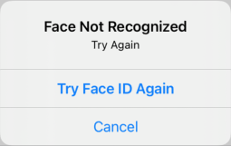

# Biometrics

<a href="https://developer.apple.com/swift"></a>


- The password screen will show only when the fallback option is set to true
- For simulator: *Features / Face ID (or Touch ID) / Enrolled*
  - And when prompted for authentication: *Features / Face ID (or Touch ID) / Matching or Not*
- Touch id - provide reason in LAContext rather than in plist
- Face id - plist privacy permission and message for reason
```xml
<key>NSFaceIDUsageDescription</key>
<string>$(PRODUCT_NAME) would like to authenticate using face ID</string>
```


   
