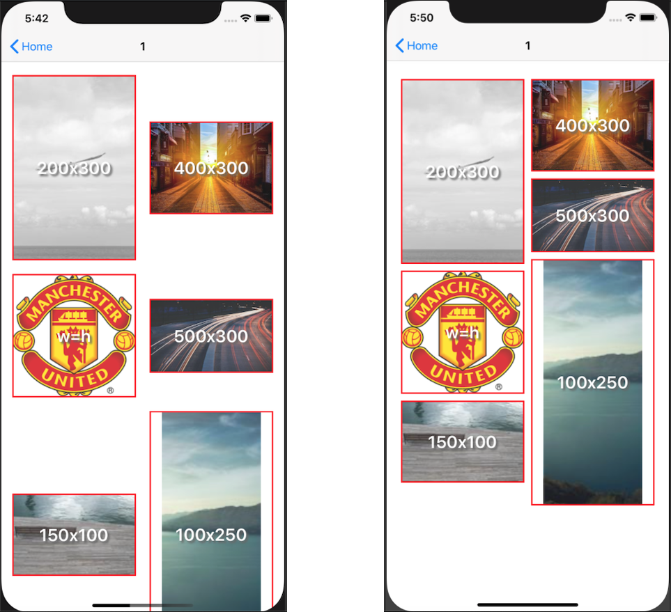

# Pinterest-like-collectionViewLayout

</a>



*`credits to raywenderlich.com`*

#### Sample usage:

```swift
let pinterestLayout: PinterestCollectionViewLayout = {
    let l = PinterestCollectionViewLayout()
    l.numberOfColumns = 2
    l.cellPadding = 5
    l.defaultCellHeight = 100
    return l
}()

// UICollectionViewController constructor
public init() {
    super.init(collectionViewLayout: pinterestLayout)//flowLayout)
    (collectionView.collectionViewLayout as? PinterestCollectionViewLayout)?.delegate = self
    collectionView?.contentInset = UIEdgeInsets(top: 20, left: 16, bottom: 20, right: 16)
}

override func viewWillTransition(to size: CGSize, with coordinator: UIViewControllerTransitionCoordinator) {
    super.viewWillTransition(to: size, with: coordinator)
    collectionViewLayout.invalidateLayout()
}


extension SampleCollectionViewController: PinterestCollectionViewLayoutDelegate {
    func collectionView(_ collectionView: UICollectionView, heightForItemAt indexPath: IndexPath) -> CGFloat {
        return yourImages[indexPath].size.height
        // return cell?.imageView.frame.height ?? cellSize().height
    }
}
```

```swift
// or from kingFisher's completion remake the imageView size and invalidate the collection view layout
completionHandler: { (result) in
    switch result {
    case .success(let value):
        var h = value.image.size.height
        let w = self.cellSize().width
        let imgWidth = value.image.size.width
        if w != imgWidth && imgWidth != 0 {
            h *= (w / imgWidth) // keep aspect ratio
        }
        h = min(h, 2 * w) // set maximum allowed height
        guard ceil(cell?.imageView.bounds.height ?? -1) != ceil(h) else { return } // stop here in case the cell is reused

        //UIView.performWithoutAnimation {
            collectionView.performBatchUpdates({
                cell?.setupConstraints(withHeight: h, andWidth: w)
            }, completion: { _ in
                collectionView.collectionViewLayout.invalidateLayout()
            })
        //}

    case .failure(let error):
        print(error.localizedDescription)
    }
}

func cellSize() -> CGSize {
    let cellPadding = pinterestLayout.cellPadding
    let cellsInRow = CGFloat(pinterestLayout.numberOfColumns)
    let innerUnusedSpace = cellPadding * 2 * cellsInRow
    let unusedSpace = collectionView.contentInset.left + collectionView.contentInset.right + innerUnusedSpace
    let size = (collectionView.bounds.width - unusedSpace) / cellsInRow
    return CGSize(width: ceil(size), height: ceil(size))
}
```
