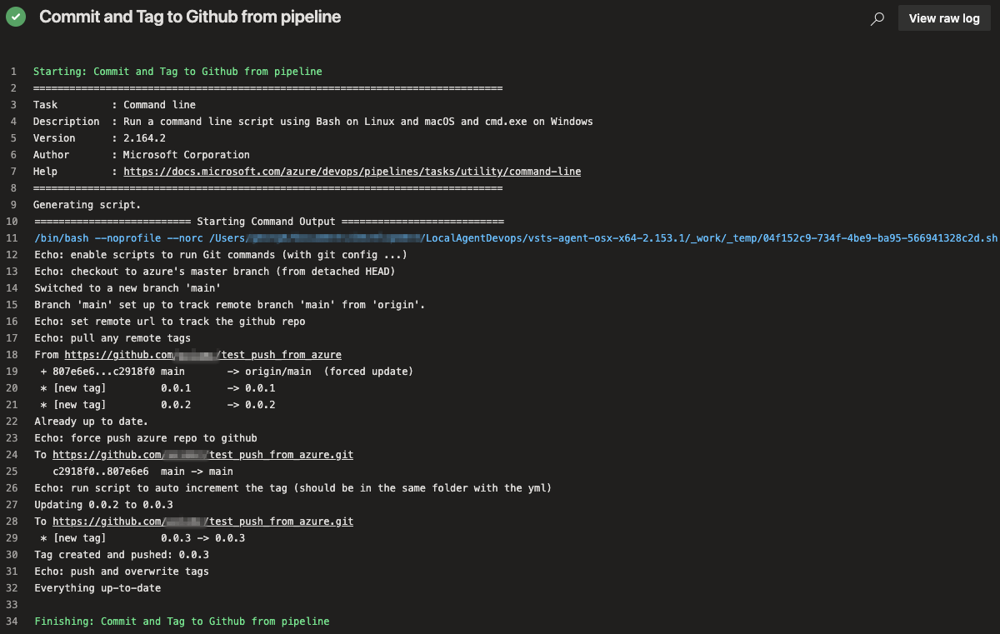

# Azure pipeline to update Github repo

#### Notes:
- add the *sh* file to the repo where the *yml* is.
- enable *'GenericContribute'* permission in the project's settings.
- the *yml* will force push (along with the tags) to the respective Github repo that is set to track (modify the url in the pipeline).
- the tag is auto incrementing the patch version e.g: 0.0.1 -> 0.0.2 (modify accordingly from the .sh)

Sample Azure job output:
