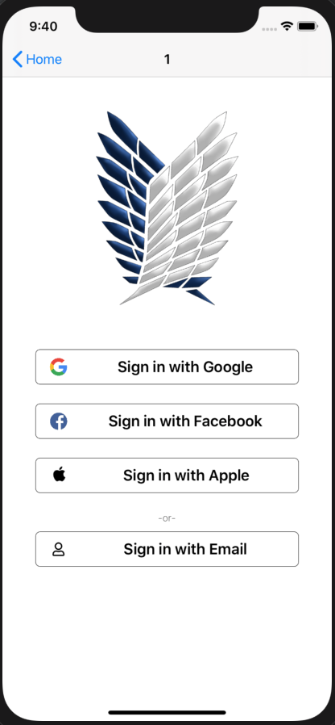

# SignInOptions
A sign in screen with custom buttons

</a>



**Facebook:**
- [developers.facebook.com iOS login](https://developers.facebook.com/docs/facebook-login/ios)
- pod (for swift or objc) + create project and add the app's bundle id.
- From the dashboard in your [facebook apps](https://developers.facebook.com/apps/) project, you get the appID for the plist

**Google:**
- [developers.google.com iOS login](https://developers.google.com/identity/sign-in/ios)
- pod + create project with OAuth client id

**Apple:**
- Bundle identifier with capability "Sign in with Apple"
- Project target / Signing & Capabilities / + Capability
- [Custom button guidelines](https://developer.apple.com/design/human-interface-guidelines/sign-in-with-apple/overview/buttons/)

#### pList:

```swift
<key>CFBundleURLTypes</key>
<array>
    <dict>
	<key>CFBundleURLSchemes</key>
	<array>
	    <string>fb{your-app-id}</string>
	</array>
    </dict>
    <dict>
	<key>CFBundleTypeRole</key>
	<string>Editor</string>
	<key>CFBundleURLSchemes</key>
	<array>
	    <string>your_google_reversed_client_ID</string>
	</array>
    </dict>
</array>


<key>FacebookAppID</key>
<string>{your-app-id}</string>
<key>FacebookDisplayName</key>
<string>{your-app-name}</string>
<key>LSApplicationQueriesSchemes</key>
<array>
    <string>fbapi</string>
    <string>fb-messenger-share-api</string>
    <string>fbauth2</string>
    <string>fbshareextension</string>
</array>
```
